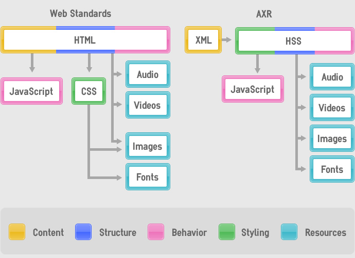
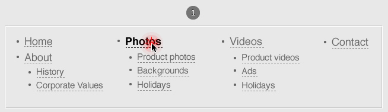
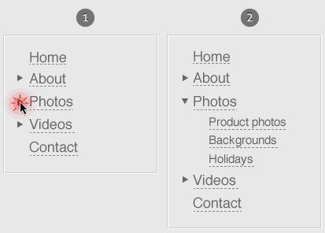
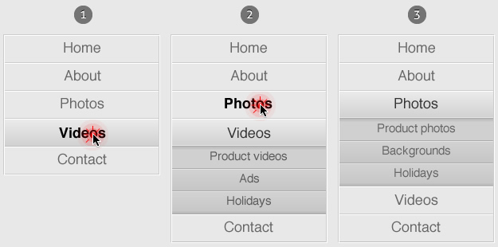
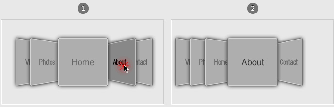

Hello... Test... One two... Is this thing turned on? Oh, hi there! And welcome
to the official blog of the AXR Project! This will be a place where we will
publish our progress, explain features and our design rationale about everything
AXR related. Also, while we lack better means, we will publish any annoucement
we make on these pages as well.

## What is AXR?
AXR (pronounced &quot;axer&quot;... hey, its a guy with an axe!) stands for
Arbitrary XML Rendering, and its aim is to provide a better alternative to the
HTML/CSS combination that is usually used to create websites and web
applications. It is not completely new, though, but rather the next step in the
evolution of web technologies, building on the lessons learned throughout the
many years of their existence, discarding the many defects that plague the work
of so many web designers and developers in the industry, and providing a great
platform on which to build awesome user experiences.

<!--more-->

The end goal is to create a new official standard for creating websites and web
application, built by an open-source community whose priority is to care for the
web, its users and its authors, rather than putting the business goals of any
company at the top of its agenda. Collaboration from the browser makers will be
useful but not critical to achieving our goals, as detailed later in this
article.

Plain text files containing source code, images, fonts and other resources are
combined to create the final page, just like in today&#39;s web standards. AXR
documents use [XML](http://en.wikipedia.org/wiki/Extensible_Markup_Language) for
the content and HSS (Hierarchical Style Sheets) for presentation in a very
similar way to how HTML and CSS are used together to create a website: the
markup is the content layer and a linked stylesheet will instruct the rendering
engine how to display that content. A critical difference is that, while HTML
serves not only as structure for information, but also for the behavior and the
general structure of all elements in your page, in AXR the content is just pure
semantic information, with no knowledge whatsoever about how it is going to be
finally displayed, and the structure and behavior are defined where they really
belong, the presentation.

Figure 1: How files are linked to create the final document

If putting behavior together with presentation sounds weird to you, consider
this: Usually, the specific responses to user interactions are deeply ingrained
with how that user interface is displayed. Imagine for example a navigation menu
on a web site, usually a list of links to sections and maybe subsections. This
list could be displayed as:

- **A plain list**: click a link to open it.
  

- **An outline**: click the little disclosure triangles to display the
  sub-elements.
  

- As **an accordion menu**: clicking elements slides panes around, hiding the
  currently visible sub-elements while revealing other ones.
  

- Or even as **a CoverFlow-esque slider**: click elements not in the center and
  it will slide to that element
  

- ... you name it.

As you can see, for the exact same content, depending on how we are going to
present it to our users, we require different behaviors to make the interface
work. So, why put it with your markup?

Continue reading: [Hello World, part 2: The Standard](/blog/2011/hello-world-part-2)
