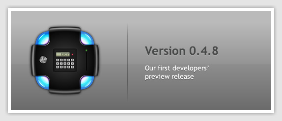

We're proud to announce our first developers' preview release! After countless
hours of hard work, we've finally come to a point where can put out the first
in a series of milestones that will be coming over the next couple of months.
So much has happened since we last published a blog post that it will be hard
to truly cover everything, but I'll try to summarize where we are right now.

For starters, a lot has changed under the hood. We completely removed a miriad
of dependencies (along with their transcient dependencies), and now rely
entirely on the [Qt library](http://qt-project.org/). Cairo, Pango, Boost,
Expat, Glib, SDL... all gone! Also, we modularized our code. Now we have several
repositories on our GitHub page (not including stuff like the website and
repositories for storage):

- core: This is the essence of the rendering library. In here lives the code
for things like the parser, the objects, the rendering, etc.
- common: Scripts and text files for that are shared by other repositories.
- browser: This is our example mini-browser, we use it to test the core
library.
- plugin: This is the "glue code" that makes the core library work as a
standard browser plug-in.
- examples: Sample code demonstrating how to embed the library
- framework: The HSS framework that will be distributed together with the AXR
runtime, which will include commonly used UI components for use in web
sites/apps.

New features
------------

On the other hand, there have been many improvements in key areas of the core
library, to increase its stability and reliability, while other changes have
been made to prepare for future additions, which, since we are now Qt based,
will be in many cases writing the glue code to use many of the features that
this library provides.

Here's a list or new features that we have added in this release:

- We added @parent reference object, which can be used in selector chains to
access the parent element of the current one.
- We implemented the attr() function, which allows attributes of the xml
elements to be accessed.
- We implemented the visible property of @container.
- Colors can now be 5 and 7 digits long, too. Also, we added the black, white
and transparent keywords for colors.
- We added a bunch of filters, like :firstChild, :lastChild, :even, :evenChild,
:odd, :oddChild, :parent and :empty.
- We now use Cmake and Cpack for building and distributing.
- The xml-stylesheet instruction now uses href instead of src, to be consistent
with how other kinds of stylesheets are usually linked.
- We did a massive reorganization of the source code structure, as explained
before.
- We added an error console, though a very basic one.
- The "overflow" property was renamed to "contained".
- The loading and parsing of XML files is now more reliable.
- We now use Continuous Integration.

What's coming
-------------

Finally, I'd like to point out that we are working hard on our documentation,
which is still between very lacking and inexistent, but rest assured we are
putting much effort on this area and the situation will improve soon. For
the meantime, if you want to get an introduction to all the stuff that can be
done now, make sure to get in touch with us on our IRC channel #axr on the
irc.freenode.net server. There's almost always someone online who will be glad
to answer any question you might have.

So head on over to our [download section](http://axrproject.org/downloads), and
grab yourself a build for your platform. *Happy toying!*
