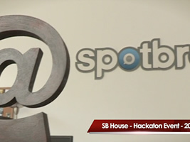

We're very happy to announce that our new video is now online. Miro Keller gave
talk about the project on the 12th of May 2012 in Madrid, at the Hackaton event
that the SpotBros guys organized.

You can see it on our home page [axrproject.org](http://axrproject.org) or
directly on [Youtube](https://www.youtube.com/watch?v=QwLY2gYyTFE).

The event was amazing, including such amazing stuff like rendering engines for
robot arms and even DIY 3D printers! To top it off, after all the talks were
over we had delicious burgers on the BBQ, where the discussions and the general
chit-chat continued for hours. We made some great new contacts, too.

Also, veosotano and Funcod met in real life for the first time! Funcod was in
Madrid for the first time, so veosotano showed him around a bit, and even live
discussed some aspects of the syntax of the HSS language.

 

Check out the video, and let us know what you think. We would really love to
hear what you guys have to say. Love it? Hate it? Let's hear what you've got to
say! :D
