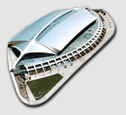
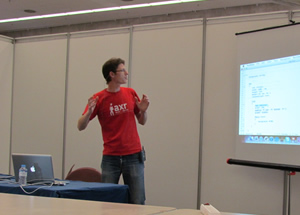
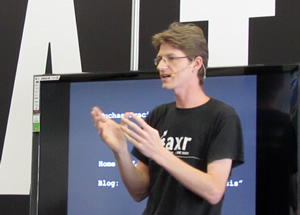

After an fun-packed, awesome and exhausting weekend, I'm back home. For all of
you that couldn't attend (which I guess is 99.9% of the people who read this),
here's my report of how it went down.

## Overview of the event

As I was told, the TLP is the second-biggest LAN party in Spain, with 1600
participants (with computer, at least twice as much attendees in total) only
behind the one held in the Basque Country, in northern Spain. From the 17th to
22nd July, the 12.000m2 of the International Trade Fair and Congress Centre of
Tenerife became home to a world of Manga/Anime, video games, 3d graphics, retro
consoles and software development.

The venue was full of elves, ninjas, super heroes, robots, nerds, geeks,
artists, developers, scientists... and even some (not many) "normal" people. The
top floor was divided in 3 main areas: the manga/illustrations zone, filled with
booths covered with amazing drawings, comic collections and Warhammer
miniatures; the central stage, a sort of huge tent in which video game
aficionados fought to be the king of plastic guitars, virtual cars or first
person shooters; and a huge array of desks where 27km of cable connected what
has to be the copyright lobbyist's worst nightmare.

In the lower floor was where all the "serious" stuff took place. Scientists,
engineers, 3d artists and animators gave speeches, workshops, demos and all
sorts of fun activities, like playing with solar-powered Scalectrix cars. HTML5,
JavaScript, Backbone.js, CoffeeScript, CSS, CakePHP or Django are just a few
examples of the buzzwords that were thrown around for good measure.

## Lessons learned

I gave a workshop Friday, 20th, and a short speech on Saturday. The workshop
wasn't so well attended, but I think I found out why, and this lesson will allow
me to do better next time. It started at 16:00, just after lunch break, and many
people didn't come back until about an hour later. Also, most of the people
didn't read the description of the courses on the website, but instead just
popped into whatever sounded most interesting at any given time. Therefore, the
title is crucial, and what I chose, "Introducción a AXR y HSS: una alternativa
para el futuro de la web", which translates to "Introduction to AXR and HSS: an
alternative for the future of the web", doesn't contain any of the words or
acronyms people are used to or probably even heard about, therefore stuff like
Arduino or CakePHP, or anything containing HTML5 immediately had way more
traction. It was too generic and obscure to really entice people to check it
out.

On the bright side, those that did attend and I had a really great time, and
after the full 2 hours, we even continued talking on the spot, about the layout
algorithm, about the stuff that's coming down the road, etc.

On Saturday, 21st, I took part of the Descon2, which are short talks of
6 minutes + 4 minutes for questions. This year's edition included stuff like a
sport that is gaining traction on Tenerife (roller derby), analogy photography
(lomography) and even rocket enthusiasts, amongst other things.

It's a sad thing this took place after the workshop, since the response to the
AXR Project was great, with many interested people asking many good questions.
I'm sure they would have enjoyed the workshop, but it was already late by then.
Maybe next year... :)

## Great moments

As a summary, I can say I truly had an incredible time. Here are some of the
highlights for me:

- Meeting many interesting people, including many coming from fields other than
  computer sciences, including Juan García
  ([@blogoff](https://twitter.com/blogoff)).
- Finally meeting Yeray Darias ([@ydarias](https://twitter.com/ydarias)) and
  Juanma Barroso ([@jmbarroso](https://twitter.com/jmbarroso)) in person and
  having lunch with them (together with a couple more awesome people) in San
  Andrés.
- Watching the hilarious presentation of the creator of Cálico Electrónico, a
  Flash based super hero parody animation series.
- Staying at the Silken Atlántida 4 star hotel, which is really nice. We also
  enjoyed the whirlpool and sauna that was included.Definitely recommended.
- Strolling around the city of S/C de Tenerife and taking a tour on the tourist
  bus, which allowed us to see all the major highlights as well as leaving us
  right at our hotel before we headed to the airport.
