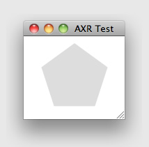
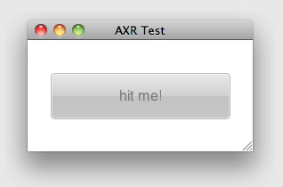

A lot has happened since our last release (v0.46). We now have a video of the
presentation Miro gave at the SpotBros Hackaton event and things have started to
move forward on the prototype. We have had many new faces on our IRC channel and
the core group of volunteers is now more active than ever. We are hard at work
on the specification, documentation, development of the website, coding on the
prototype and trying our best to communicate out to the world via the social
networks where we participate.

<!--more-->

On the website, we now don't have any "Under Construction" page anymore. Phew!
I'm sure that bugged many of our visitors. Our wiki is now fully functional and
growing day by day, and we're using the blog, though not as much as we'd like.
Also, now we have documentation for most of the classes in the prototype, which
we hope will help with getting more committers on the code side.

We also updated the READMEs on all the repos, so that they are much more user
friendly to potential new contributors. Check them out, for example here:
https://github.com/AXR/Prototype or here: https://github.com/AXR/Website, in the
lower part of the site.

## Changes on the prototoype

Each time it is getting more awesome to play with the prototype! Here are some
of the new cool stuff one can do with it now:

### New shape object: @polygon

You now can use the @polygon object in the "shape" property on @containers.
You'll get a polygon of the number of sides and starting angle you set, where
each point is on the circle with given width/height of the container.

Both "sides" and "angle" properties accept numbers. In the latter, it is
measured in degrees in a 360º circle. So, for example, opening this file in the
prototype:

	// language=hss
	// always targets root
	*
	{
		contentAlignY: 50%;

		// create a new test element
		#new test
		{
			width: 100;
			height: 100;
			background: #D;

			// apply the shape
			shape: @polygon {
				angle: 270; // top, will be changed to 0 in future versions
				sides: 5;
			};
		}
	}

will look like this:

### New property on @container: "content"

The first incarnation of the content property on containers is here. In the
future it will accept more things, but for now what you can do with it is assign
a content text for the container from HSS, overriding whatever could have come
from the XML. You should keep in mind that this should only be done when the
semantics are not an issue, being it a purely presentational feature.

For example:

	// language=hss
	// always targets root
	*
	{
		// create a new test element
		#new test
		{
			// set this to be the content text
			content: "Hello World";
		}
	}

### Support for loading the HSS framework (Windows support comming soon)

You can now get your lips wet with the first pre-preview of what using the HSS
framework will be like (because stuff is bound to change still). Consider this
example HSS file:

	// language=hss
	// import the framework
	#import UIFramework;

	// always targets root
	*
	{
		contentAlignY: 50%;

		// create a new myButton element
		#new myButton
		{
			// apply the UIButton preset
			isA: UIButton;

			// we customize it a bit
			width: 200;
			height: 50;
			content: "hit me!";
		}
	}

This will result in the following document:

### Support for selector grouping

We've recently added support for using grouping in selector chains. Separate
them with a comma "," and they will both matched against the current scope.
Trailing commas are also supported (a comma after the last
selector chain), which makes common copy and paste operations much easier.

Suppose we have the following XML:

	<!-- language=xml -->
	<?xml version="1.0" encoding="UTF-8" ?>
	<?xml-stylesheet type="application/x-hss" src="style.hss" version="1.0" ?>
	<document>
		<elementA />
		<elementB />
		<elementC />
		<elementD />
	</document>

And the following HSS file called style.hss:

	// language=hss
	// always targets root
	*
	{
		// simple example
		elementA, elementC { content: "First group" }

		// notice the trailing comma before the block
		elementB,
		elementD,
		{
			content: "Second group";
		}
	}
