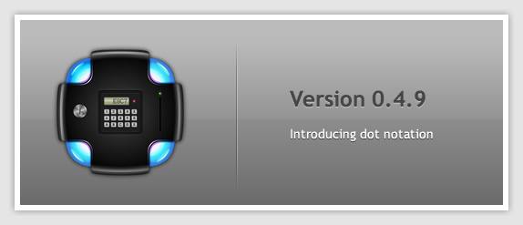

Hey everyone!

After a couple of months of slow progress, finally we have our next release out
of the door: 0.4.9. It adds many new features and massive improvements under
the hood.

I hope you guys can take it for a ride and discover bugs, write tests and in
general let us know what you think, feedback is very much appreciated. Head over
to our IRC channel and let us know!

Also, check out the [tutorials](http://axrproject.org/resources/tutorials) we've
added to the website to get you started with HSS. They are under the "Resources"
menu in the main navigation of our website.

New features
------------
We have added many author-facing features, here's a list of the more important
ones:

- Implemented "takeFlag()"
- Partial Radial Gradients Support
- New logging system (with debug channels and GUI)
- Add support for using flags in nested rules
- Flags now use the same notation as refs. E.g. "flag(foo of @this)" instead of
"flag(foo on @this)"
- #move should work now
- New layout tests system
- Implemented "lineAlign property", for when multiple lines are formed in layout
- Percentage margins and paddings
- Add support for "isA: ref(prop of otherElem)"
- Add support for using rules inside container objects that are applied with isA
- Implement dot notation for setting properties and references
- Handle "specificity" to correctly abide by HSS' rules about when to overwrite
values in properties

Out of these, I'd say the most important one is dot notation. Here are a couple
examples how you can use it.

This will make the color, which was defined as opaque, be semitransparent on the
`foo` element:

    // language=hss
    #ACE myColor;
    foo
    {
        background: myColor;
        background.alpha: 50%;
    }

Here you can see a more advanced, version, where a container object is applied
via the `isA` property, and then the alpha property of the end color of the
gradient is changed:

    // language-hss
    @container myPreset {
        background: @linearGradient {
            startColor: #ACE;
            endColor: #8AC;
            endY: 100%;
        }
    }
    foo
    {
        isA: myPreset;
        background.endColor.alpha: 100%;
    }

And finally, here we dig into the properties of a value object to get the value
we want:

    // language-hss
    foo
    {
        data: @value {
            propertyA: 100;
            propertyB: 200;
            propertyC: 300;
        };
        amount: ref(data.propertyB of @this); //will contain 200
    }

What's coming
-------------

Our next release will focus on moving to Qt5, adding support for loading files
over HTTP requests, beginning of JS support, more shapes and path options...
in short, awesome stuff, so keep checking back soon for new releases!

So head on over to our [download section](http://axrproject.org/downloads), and
grab yourself a build for your platform. *Happy toying!*
